<!-- @format -->

# 🏥 Patient Record Management System

A command-line based Patient Record Management System built with Python. It allows hospital staff to manage patients, wards, and admissions efficiently through a simple interactive menu.

---

## 📋 Table of Contents

- [About the Project](#about-the-project)
- [Features](#features)
- [Project Structure](#project-structure)
- [Requirements](#requirements)
- [How to Run](#how-to-run)
- [Usage Guide](#usage-guide)
- [Data Storage](#data-storage)
- [Known Limitations](#known-limitations)

---

## About the Project

This system was built as a Python OOP project to simulate a basic hospital patient record system. It supports adding and managing patients, organizing wards, and tracking admissions and discharges — all from the terminal.

---

## Features

- Add, view, search, update, and delete patient records
- Add and view hospital wards with capacity tracking
- Admit patients to wards and discharge them
- Persistent data storage using JSON files
- Input validation throughout the system

---

## Project Structure

```
PATIENT_RECORD_SYSTEM/
│
├── data/
│   ├── patient.json          # Stores all patient records
│   ├── ward.json             # Stores all ward records
│   └── administration.json   # Stores all admission records
│
├── modules/
│   ├── __init__.py
│   ├── person.py             # Base class with shared attributes
│   ├── Patient.py            # Patient model (inherits Person)
│   ├── ward.py               # Ward model
│   └── administration.py     # Administration/admission model
│
├── services/
│   ├── __init__.py
│   └── Hospital_System.py    # Core logic, CRUD, save/load
│
├── main.py                   # Entry point and menu system
└── README.md
```

---

## Requirements

- Python 3.10 or higher
- No external libraries required (uses built-in `json`, `os`, `datetime`)

---

## How to Run

1. Clone or download the project folder.

2. Navigate to the project directory:

```bash
cd Patient_Record_System
```

3. Run the program:

```bash
python-or-python3  main.py
```

> Data is automatically loaded on startup and saved on exit.

---

## Usage Guide

### Main Menu

When you run the program you will see the main menu:

```[ SCREENSHOT]
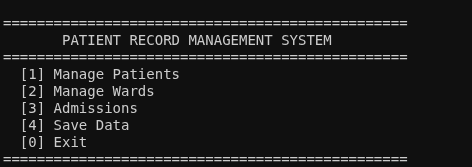

---

### 1. Manage Patients

**[ SCREENSHOT — Main Patient Menu ]**

| Option | Description            |
| ------ | ---------------------- |
| 1      | Add a new patient      |
| 2      | View all patients      |
| 3      | Search by name or ID   |
| 4      | Update patient details |
| 5      | Delete a patient       |
| 0      | Go back                |

**Adding a Patient**

You will be prompted to enter:

- Patient ID (must be unique)
- Full Name
- Email Address
- Phone Number
- Date of Birth (YYYY-MM-DD)

**[ SCREENSHOT — Add Patient ]**

---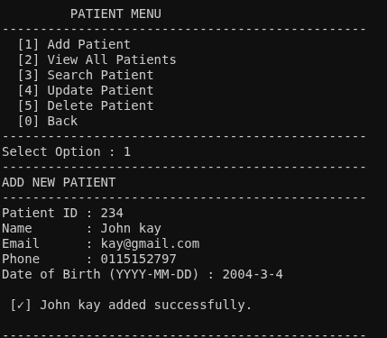

**Searching for a Patient**

Enter part of a patient's name or ID to find matching records.

**[ SCREENSHOT — Search Patient ]**

-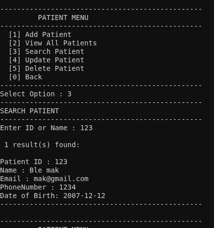

### 2. Manage Wards

**[ SCREENSHOT — Ward Menu ]**

<!-- 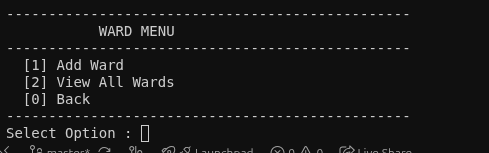 -->

**Adding a Ward**

You will be prompted to enter:

- Ward ID (must be unique)
- Ward Name
- Doctor Name assigned to the ward
- Capacity (number of patients the ward can hold)

**[ SCREENSHOT — Add Ward ]**

<!-- 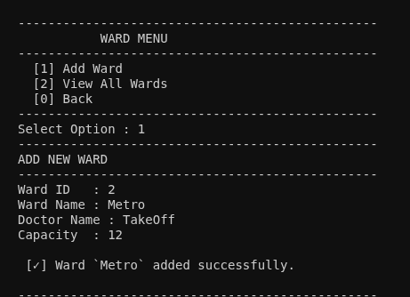 -->

**Viewing Wards**

Displays all wards along with how many patients are currently admitted and how many slots are available.

**[ SCREENSHOT — View Wards ]**

<!-- 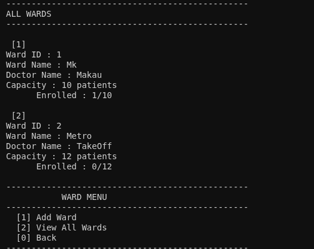 -->

### 3. Admissions

**[ SCREENSHOT — Admissions Menu ]**
<!-- 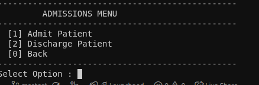 -->


**Admitting a Patient**

- Enter the Patient ID and Ward ID
- The system checks if the patient exists, the ward exists, the patient is not already admitted, and the ward has available capacity
- Admission date and time are recorded automatically

**[ SCREENSHOT — Admit Patient ]**

<!-- 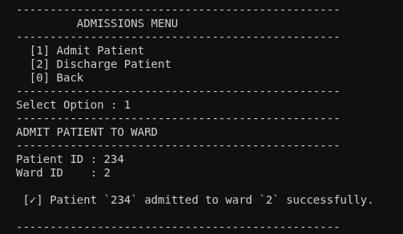 -->

**Discharging a Patient**

- Enter the Patient ID and Ward ID
- The system confirms the active admission and removes the record

**[ SCREENSHOT — Discharge Patient ]**

<!-- -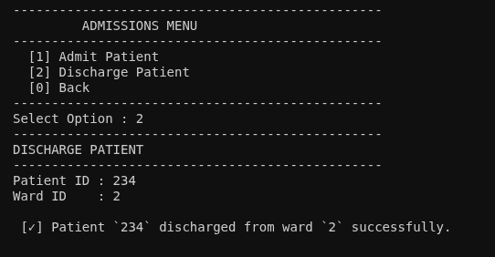 -->

### 4. Save Data

Manually saves all current records to the JSON files in the `data/` folder.
**[SCREENSHOT - Save data]**
<!-- 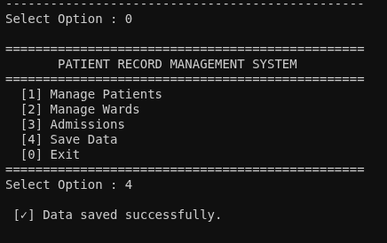 -->

> Data is also saved automatically when you exit using option `[0]`.

<!-- 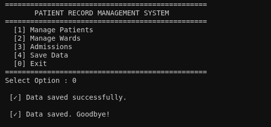 -->
---

## Data Storage

All data is saved locally in JSON format inside the `data/` folder:

| File                  | Contents                     |
| --------------------- | ---------------------------- |
| `patient.json`        | All patient records          |
| `ward.json`           | All ward records             |
| `administration.json` | All active admission records |

The files are created automatically the first time you save data. If they are empty or missing the system will start fresh without crashing.

** [SCREENSHOT of data storage]**
<!-- 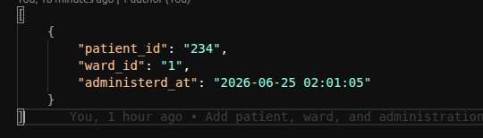  --> Administration.json
<!-- 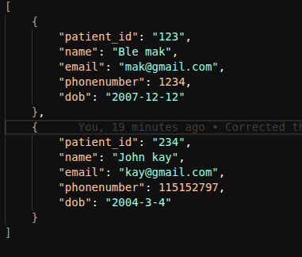 --> Patient.json
<!-- 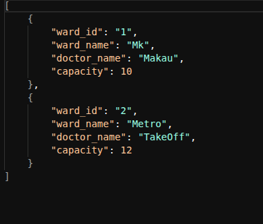 --> Ward.json

---

## Known Limitations

- No login or authentication system
- Data is stored locally — no database integration
- Doctor information is stored per ward, not as a separate entity
- No appointment scheduling system
- Discharge notes are not currently stored persistently

---

## Author

Blexsoc
